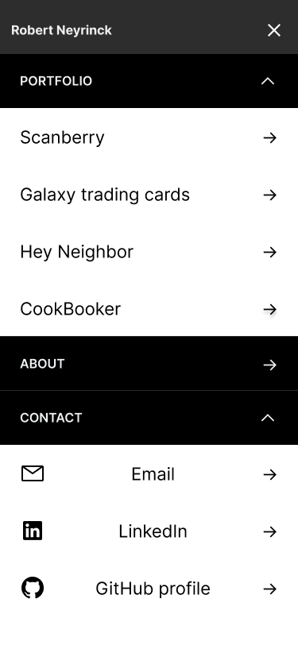
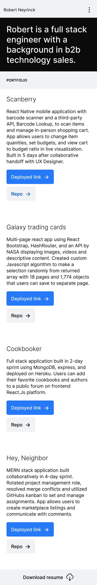
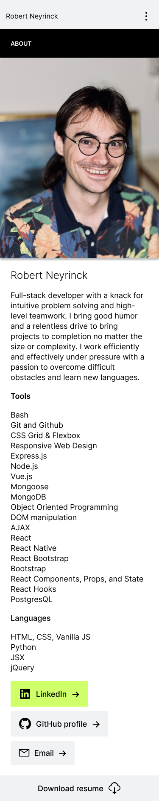

# Robert Neyrinck Portfolio

    Hi!

    I'm Robert Neyrinck, previously a technology salesman, purpetually a gamer, and, currently, transitioning to a career as a full-stack software engineer.

    This is my (newest) portfolios Readme file, and in it I'll cover what technologies were used, what the design process looked like, and any issues that I ran into.

    Thanks for taking the time, and please take a look at the site below!

    Best,

    Robert

## [Deployed Link](https://rneyrinck.github.io/Portfolio-2022/)

# Contents
- Description of the portfolio 
    * Describes the design/development of the project 
- Technology Used
    * Lists languages/frameworks used in the project
- Site Map
    * Table displaying the URL routes for navigation
- React Components
    * Table displaying react components and their functions
- Wireframes
    * Images of the wireframes used in designing the project

## Description of the portfolio

This is the third rendition of my portfolio, and first project post-bootcamp(General Assembly's Software engineering immersive). The app is built with react and, where bootstrap styling lined up with the UI, react-bootstrap for a majority of the styling. Some elements (the custom header with chanigng color on click) were custom coded to allow for a more unique look than the built in bootstrap components.

My partner is a product designer and I've had the good luck to be able to work with them on some of my projects. They designed mobile first wireframes in figma and passed it along to me for development. I'm happy with how it came out as the general layout will be much more scaleable than my previous portfolio(and it looks alot nicer!).

I appreciate you taking the time to look over my work, and look forward to any notes you may have on either my organization or code!

## Technology Used

### HTML, CSS, Javascript
- #### Hyper Text Markup Language 
    * HTML is a W3C offical web standard language to generate the "bones" of webpages(paragraphs, lists, links to other pages etc.)
- #### Cascading Style Sheets
    * CSS is a language used to style HTML
- #### Javascript
    * Javascript is language used for creating dynamic web content. 

### React, Hooks, and Components
- #### React
    * React is a Javascript library created by Facebook. It contains reusable Javascript code for creating user interfaces. 
    * It uses JSX which is a Javascript syntax extension mainly used to embed HTML.
- #### React Hooks
    * React Hooks are a feature released in React version 16.8 that simplified writing an application in React
    * Hooks allow developers to reuse their code more efficiently, have more flexibility with where they access functional logic in their app, and have better composition of their codebase
 Components, and State

### React Bootstrap

## Site Map

|         Route          |                    Result                    |
| :--------------------: | :------------------------------------------: |
|           /            | Portfolio page displaying different projects |
|      /#scanberry       |       Anchor link to Scanberry Project       |
| /#galaxy-trading-cards | Anchor link to Galaxy Trading Cards Project  |
|     /#hey-neighbor     |     Anchor link to Hey, Neighbor Project     |
|     /#cook-booker      |      Anchor link to CookBooker Project       |
|         /about         |                  About page                  |

## React Components
|Component|Description|
|:---:|:---:|
| About | Contains brief bio, list of skills/languages, and a flattering pic-o-bob |
| Footer | Simple wrapper/footer with a link to google doc file of my resume |
| Header | Custom JS/CSS for a dropdown navbar with embedded dropdowns with links to social media profiles and contact info as well as links to the project page |
| ProjectPage | Contains list of all personal projects |
| ModalSlideShow | Project page modal embedded slideshow to display screenshots of the Scanberry project | 
| ScreenShotModal | Container component for modal slideshow | 
| App | Renders pages |

## Wireframes

### Menu Component

### Portfolio Page Component

### About Page Component

